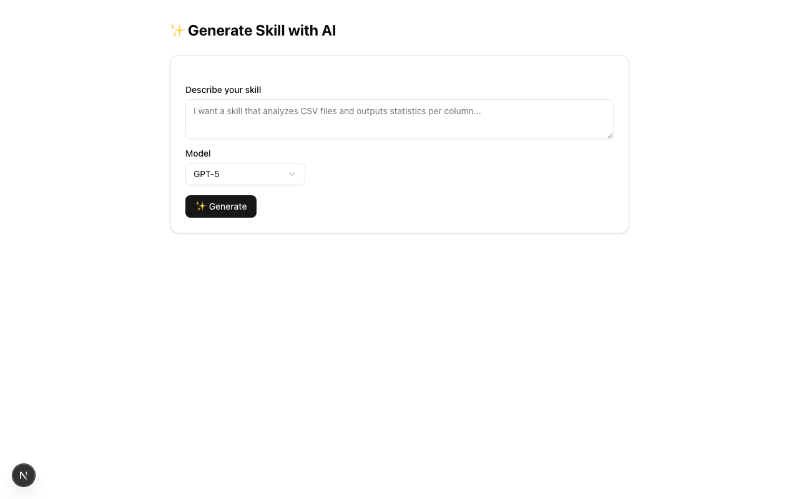
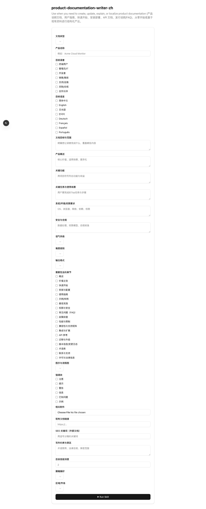
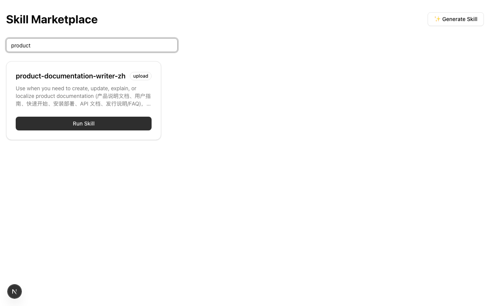

# Skill Plant

AI Skill Marketplace — 用 AI 生成、管理和运行 Claude Code Skills 的 Web 平台。

用户可以通过自然语言描述生成 SKILL.md 文件，发布到 Marketplace，然后通过动态表单提交参数，在隔离的 Docker 容器中运行 Claude Code CLI 执行任务。

## 架构

```
skill-plant/
├── apps/
│   ├── web/          # Next.js 16 前端 (React 19 + shadcn/ui)
│   └── api/          # Hono + Bun 后端 API
├── packages/
│   └── shared/       # 共享 Zod schemas 和类型
├── docker/
│   └── claude-code/  # Claude Code CLI Docker 镜像
└── docker-compose.yml
```

## 技术栈

| 层       | 技术                                                       |
| -------- | ---------------------------------------------------------- |
| 前端     | Next.js 16, React 19, Tailwind CSS 4, shadcn/ui, Radix UI |
| 数据获取 | TanStack Query, Vercel AI SDK v6, React Hook Form + Zod    |
| 后端     | Hono, Bun                                                  |
| 数据库   | PostgreSQL 16, Drizzle ORM                                 |
| 队列     | BullMQ + Redis                                             |
| AI       | Anthropic Claude, OpenAI GPT, Google Gemini (多模型支持)   |
| 执行     | Docker 容器中运行 Claude Code CLI                          |
| 构建     | Turborepo, pnpm                                            |

## 核心功能

- **Skill Marketplace** — 浏览、搜索已发布的 Skills
- **AI 生成 Skill** — 用自然语言描述需求，AI 流式生成 SKILL.md 文件，支持多模型选择
- **动态表单** — AI 分析 Skill 内容，自动生成输入表单（支持 text / file / select 等字段类型）
- **任务执行** — 通过 BullMQ 队列调度，在 Docker 容器中隔离运行 Claude Code CLI
- **实时输出** — SSE 流式推送任务状态和执行结果

## 使用指南

### Step 1: 浏览 Skill Marketplace

首页展示所有已发布的 Skills，支持按名称和描述搜索。


### Step 2: 生成新 Skill

点击右上角 "Generate Skill"，用自然语言描述你需要的 Skill，选择 AI 模型（GPT-5 / Claude Sonnet / Gemini Flash），AI 会流式生成 SKILL.md 文件。



### Step 3: 运行 Skill

选择一个 Skill 后，系统会通过 AI 自动分析 Skill 内容并生成动态输入表单。填写参数后点击 "Run Skill"，任务将在隔离的 Docker 容器中执行。



### Step 4: 搜索 Skill

在搜索框中输入关键词，实时过滤 Marketplace 中的 Skills。



## 快速开始

### 前置要求

- Node.js >= 20
- pnpm >= 9
- Docker
- PostgreSQL 16
- Redis 7

### 使用 Docker Compose（推荐）

```bash
# 1. 克隆项目
git clone <repo-url> && cd skill-plant

# 2. 配置环境变量
cp .env.example .env
# 编辑 .env，填入 ANTHROPIC_API_KEY 等

# 3. 启动服务
docker compose up -d

# 4. 前端默认在 http://localhost:3000，API 在 http://localhost:3001
```

### 本地开发

```bash
# 1. 安装依赖
pnpm install

# 2. 配置环境变量
cp .env.example .env

# 3. 启动 PostgreSQL 和 Redis
docker compose up postgres redis -d

# 4. 启动开发服务器
pnpm dev
```

## 环境变量

| 变量                         | 必填 | 说明                       |
| ---------------------------- | ---- | -------------------------- |
| `ANTHROPIC_API_KEY`          | 是   | Anthropic API Key          |
| `ANTHROPIC_BASE_URL`         | 否   | 自定义 API 代理地址        |
| `OPENAI_API_KEY`             | 否   | OpenAI API Key             |
| `GOOGLE_GENERATIVE_AI_API_KEY` | 否 | Google AI API Key          |
| `DATABASE_URL`               | 是   | PostgreSQL 连接字符串      |
| `REDIS_URL`                  | 否   | Redis 连接地址（默认 localhost:6379） |
| `CORS_ORIGIN`                | 否   | 前端地址（默认 http://localhost:3000）|
| `PORT`                       | 否   | API 端口（默认 3001）      |

## 项目脚本

```bash
pnpm dev        # 启动所有应用的开发服务器
pnpm build      # 构建所有应用
pnpm lint       # 代码检查
pnpm typecheck  # 类型检查
pnpm test       # 运行测试
```

## License

MIT
